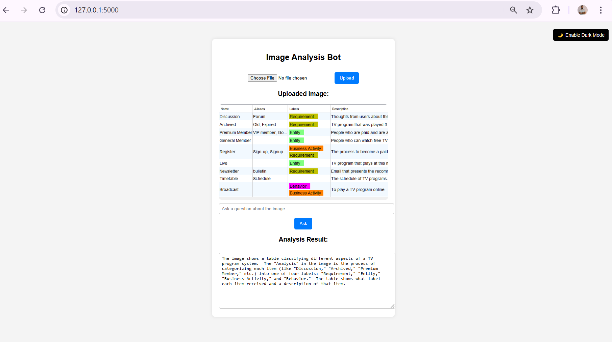

---

# Telegram_bot_with_AI_agent
---

## 🌟 **AskAtharva_bot** :: AI-Powered Image & Text Analysis Bot 🤖🖼️  
### 📌 **Overview**  
**AskAtharva_bot** is a **Telegram bot** powered by **Google Gemini 1.5 Flash** and **Phidata Playground**.  
It allows users to **upload images** and **ask questions** about them, making AI-powered **image analysis** super easy!  

---
---

## Note: I have built an web-application as well as telegram bot.I have uploaded code for both 
1)Flask web-app
2)Telegram bot (AskAtharva_bot)

---

## 1) 🌐 **Flask Web App with HTML,CSS,JS (you can check the code in **web-app.py** file)**  
In addition to the Telegram bot, you can also use the **web interface** to upload images and ask questions. This web app allows you to interact with the AI directly in your browser.

### 📌 **Web Features**  
✅ **Upload Images** – Use the browser interface to upload images.  
✅ **Ask Questions** – Just type a question about the image.  
✅ **Responsive Design** – The web app is optimized for both desktop and mobile.  
✅ **Dark Mode** – Toggle between light and dark modes for the best user experience.

### 🛠 **How to Run the Web App Locally**  
1️⃣ Clone the repository as mentioned in the setup section.  
2️⃣ Ensure you have the necessary dependencies installed by running:  
   ```sh
   pip install -r requirements.txt
   ```  
3️⃣ To start the web server, run:  
   ```sh
   python web-app.py
   ```  
4️⃣ Open your browser and go to `http://127.0.0.1:5000/` to interact with the web app.

### 🌑 Dark Mode


---

## ⚙️ **Setup & Installation**  
## 2) This is for telegram bot 

---

## 🚀 **Features**  
✅ **Ask Questions Directly** – No need for `/ask`, just send a message!  
✅ **Image-Based Q&A** – Upload an image and ask questions about it!  
✅ **AI-Powered Responses** – Uses **Gemini 1.5 Flash** for intelligent answers.  
✅ **Fast & Efficient** – Handles both text & image inputs with structured output.  
✅ **Web Playground (Optional)** – Test AI responses in a browser!  

---
### 🛠 **1. Clone the Repository**  
```sh
git clone https://github.com/Asp2591/telegram_bot_with_AI_agent.git
cd telegram_bot_with_AI_agent
```

### 🔧 **2. Install Dependencies**  
```sh
pip install -r requirements.txt
```

### 🔑 **3. Set Up Environment Variables**  
Create a `.env` file and add your **Telegram Bot Token**:  
```ini
Token=YOUR_TELEGRAM_BOT_TOKEN
```

### ▶️ **4. Run the Bot**  
```sh
python main.py
```


---

## 🎮 **How to Use the Bot?**  
1️⃣ **Send an image** 📸 → The bot stores it for analysis.  
2️⃣ **Ask a question** ❓ → "What is in the image?"  
3️⃣ **Get an AI-generated response** 🚀  

📌 **Commands:**  
- `/start` – Get a welcome message.  
- `/help` – See available commands.  

---

## 🤖 **Built With**  
- **Python** 🐍  
- **Telegram Bot API** 💬  
- **Phidata AI Playground** 🤖  
- **Google Gemini 1.5 Flash** 🚀  

---

## 🎯 **Future Enhancements**  
✅ Add **more AI models** for better image understanding.  
✅ Implement **voice input** support.  
✅ Deploy to a **cloud server** for 24/7 availability.  

---

## 🤝 **Contributing**  
Feel free to **fork**, create a PR, or open issues!  

---

## 📜 **License**  
MIT License © 2025 **AskAtharva_bot**  

---

Let me know if you'd like to make further adjustments! 🚀
